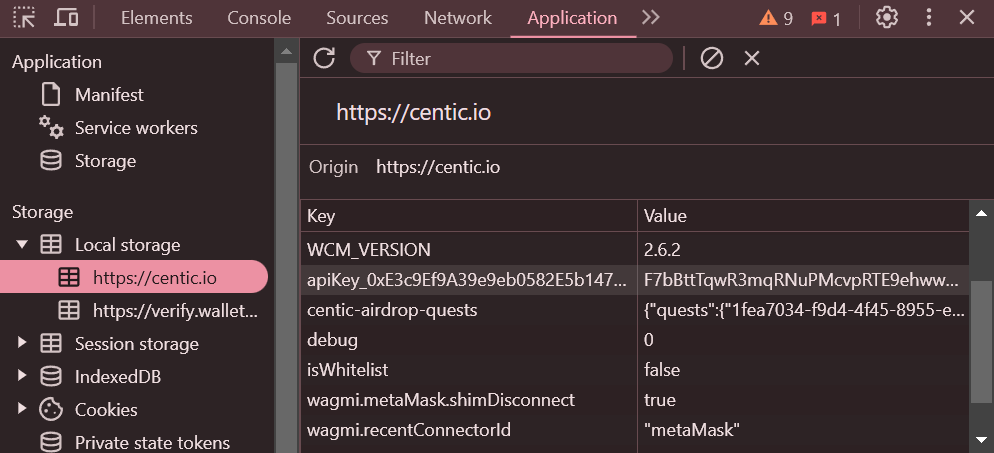

# Centic Quests BOT
Centic Quests BOT

Register Here : [Centic Quests](https://centic.io/quests/daily?refferalCode=eJwFwQERACAIBLBKwINCHPDeDMZ3k0ec4q1GsTgSaYxR32LrNMMcyDDtDwSCC20=)

## Fitur

  - Auto Get Account Information
  - Auto Complete Quests
  - Multi Accounts With Threads

## Prasyarat

Pastikan Anda telah menginstal Python3.9 dan PIP.

## Instalasi

1. **Kloning repositori:**
   ```bash
   git clone https://github.com/vonssy/CenticQuests-BOT.git
   ```
   ```bash
   cd CenticQuests-BOT
   ```

2. **Instal Requirements:**
   ```bash
   pip install -r requirements.txt #or pip3 install -r requirements.txt
   ```

## Konfigurasi

- **apikeys.txt:** Anda akan menemukan file `apikeys.txt` di dalam direktori proyek. Pastikan `apikeys.txt` berisi data yang sesuai dengan format yang diharapkan oleh skrip. Berikut adalah contoh format file:

  ```bash
    your_apikey_1
    your_apikey_2
  ```

## Screenshots

<div style="text-align: center;">
  <h4><strong>Api Key</strong></h4>
  
</div>

## Jalankan

```bash
python bot.py #or python3 bot.py
```

## Penutup

Terima kasih telah mengunjungi repository ini, jangan lupa untuk memberikan kontribusi berupa follow dan stars.
Jika Anda memiliki pertanyaan, menemukan masalah, atau memiliki saran untuk perbaikan, jangan ragu untuk menghubungi saya atau membuka *issue* di repositori GitHub ini.

**vonssy**